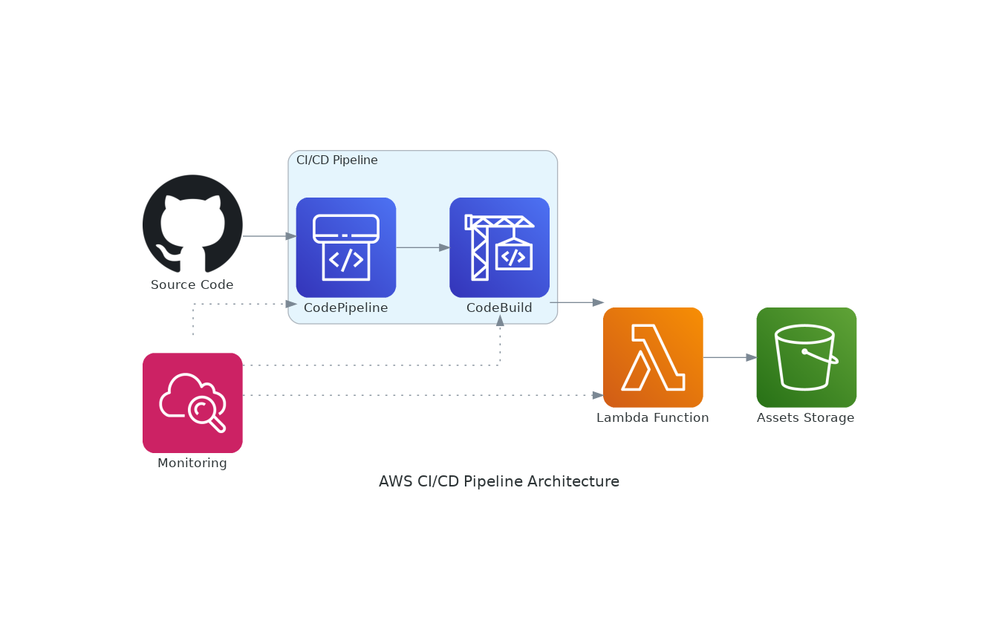
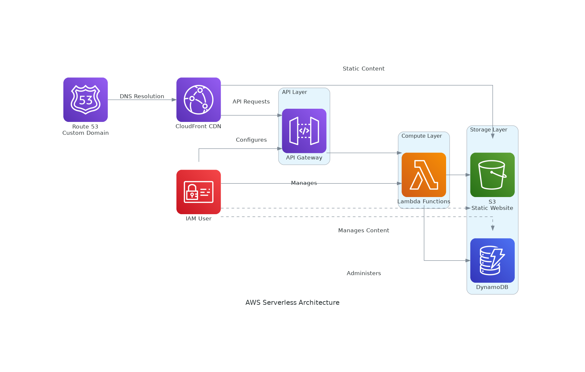

# AWS Architecture Diagram Generator

This tool uses **Amazon Q CLI** and **MCP Servers** to convert prompts into AWS architecture diagrams (PNG format) using AWS official icons.

---
## Overview

The AWS Architecture Diagram Generator helps you create professional architecture diagrams for AWS infrastructure using code. This approach allows for version-controlled, reproducible diagrams that can be easily updated as your architecture evolves.

---

## 📁 Directory Structure

- `prompts/` — Natural language prompts used with Amazon Q CLI
- `scripts/` — Python scripts to generate diagrams manually or from Amazon Q
- `diagrams/` — Output PNG diagrams
- `README.md` — This documentation

---

## 🧠 Amazon Q CLI + MCP Server

This uses natural prompts to generate AWS architecture diagrams with official AWS icons. That is MCP Server configured with awslabs.aws-diagram-mcp-server in mcp.json file provides diagram creation capabilities.

### 🔄 How It Works

1. Write a prompt in `prompts/`
2. Use Amazon Q CLI with `/editor` to run it
3. Q generates a `.py` script + `.png` diagram
4. Organize the script under `scripts/`, and the diagram under `diagrams/`

### 📌 Available Architectures

#### 1. CI/CD Pipeline

> GitHub → CodePipeline → CodeBuild → Lambda, with S3 and CloudWatch.

- 📜 Prompt: [`prompts/ci-cd-pipeline.txt`](./prompts/ci-cd-pipeline.txt)  
- 🧠 Script: [`scripts/ci_cd_pipeline.py`](./scripts/ci_cd_pipeline.py)  
- 🖼️ Diagram:  
  

#### 2. Serverless Web App

> A scalable, serverless web application stack with IAM User,API Gateway, Lambda, DynamoDB, S3, CloudFront, and Route 53.

- 📜 Prompt: [`prompts/serverless-webapp.txt`](./prompts/serverless-webapp.txt)  
- 🧠 Script: [`scripts/serverless_webapp.py`](./scripts/serverless_webapp.py)  
- 🖼️ Diagram:  
  

---

## Requirements ❓
- Python 3
- Diagrams library (pip install diagrams)
- Graphviz installed

---

## 📦 Built With

- 🧠 [Amazon Q CLI](https://aws.amazon.com/q/)
- 🔌 [MCP Servers](https://github.com/awslabs/aws-diagram-mcp-server)
- 🐍 [Diagrams Python Library](https://diagrams.mingrammer.com/)
- 🎨 AWS Architecture Icons

---

## 🛠️ To Add Next

- ✅ Flask architecture
- ✅ Pygame project template
- ⏳ More diagram prompts

---

## License

[MIT License](LICENSE)
